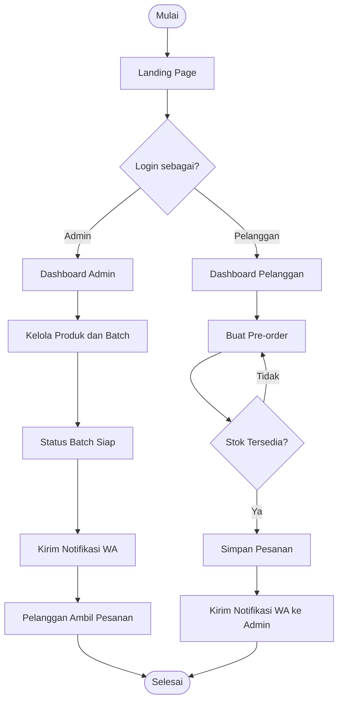
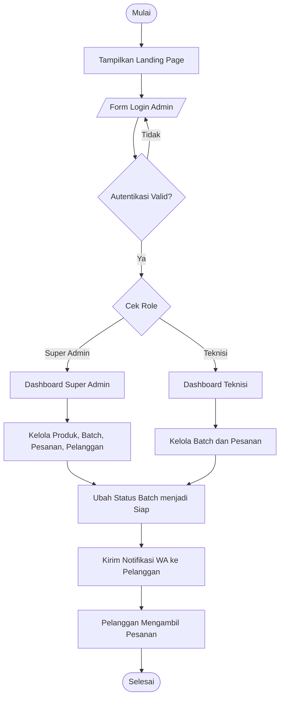
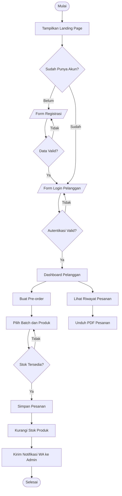

# Flowchart Sistem TEFA Canning SIP

## Flowchart Overview (Ringkas)

Gambaran umum alur sistem dalam 1 diagram.

### Keterangan Simbol

| Simbol | Bentuk | Keterangan |
|--------|--------|------------|
| Mulai / Selesai | Oval `( [...])` | Terminator awal dan akhir |
| Dashboard / Landing Page | Persegi `[ ... ]` | Proses sistem |
| Login sebagai? / Stok Tersedia? | Belah ketupat `{ ... }` | Keputusan / percabangan |

---

## Flowchart Detail — Admin / Teknisi

### Keterangan Simbol

| Simbol | Bentuk | Keterangan |
|--------|--------|------------|
| Mulai / Selesai | Oval `( [...])` | Terminator awal dan akhir |
| Tampilkan Landing Page | Persegi `[ ... ]` | Proses sistem |
| Form Login Admin | Jajar genjang `[/ ... /]` | Input / Output dari pengguna |
| Autentikasi Valid? / Cek Role | Belah ketupat `{ ... }` | Keputusan / percabangan |

## Flowchart Detail — Pelanggan

### Keterangan Simbol

| Simbol | Bentuk | Keterangan |
|--------|--------|------------|
| Mulai / Selesai | Oval `( [...])` | Terminator awal dan akhir |
| Dashboard Pelanggan | Persegi `[ ... ]` | Proses sistem |
| Form Login / Registrasi | Jajar genjang `[/ ... /]` | Input / Output dari pengguna |
| Stok Tersedia? / Data Valid? | Belah ketupat `{ ... }` | Keputusan / percabangan |
| Simpan Pesanan | Persegi `[ ... ]` | Proses penyimpanan data |

## File Diagram

| File | Keterangan |
|------|------------|
| `docs/diagrams/flowchart-admin.mmd` | Flowchart Admin/Teknisi (standalone Mermaid) |
| `docs/diagrams/flowchart-customer.mmd` | Flowchart Pelanggan (standalone Mermaid) |
| `docs/diagrams/flowchart-sistem.mmd` | Flowchart gabungan (referensi lama) |
